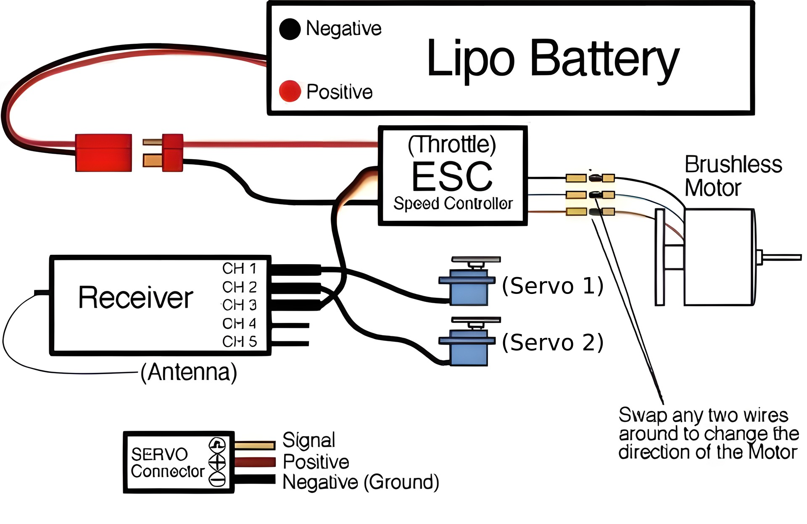

# RC Plane: Berkik 3

In the realm of remote-controlled devices, RC planes have gained much popularity. Flying these planes is fun and allows for seamless command interpretation from your remote control. RC planes offer an engaging hobby that combines technical skills with the thrill of flight, making them appealing to enthusiasts of all ages.

This guide will help you explore the potential of RC-controlled planes using ESC, with a fun and practical project: RC controlled Berkik 3 plane.

## Components Required: 
1. Brushless Motor 1400kV (×1)
2. 30 Amp ESC (×1)
3. 8045 Propellers (×1)
4. Transmitter and Receiver (×1)
5. 2200mAh 3S liPo Battery (×1)
6. SG90 Servo (×2)
7. Control horn (×2)
8. Metal rods for linkages
9. Depron sheets
10. Tape and Adhesive

You'll find the plans for the RC Plane in the plans folders of this repository, also find a detailed explanation of the components and their use in the ['tutorial'](./tutorial/tutorial.md) folder. Start building right away!

- *Berkik 3 plans*
- *credits: Paper Replika*
- *Schematic credits: Sky Hobbies Singapore*

Build Smart🛠️✨
